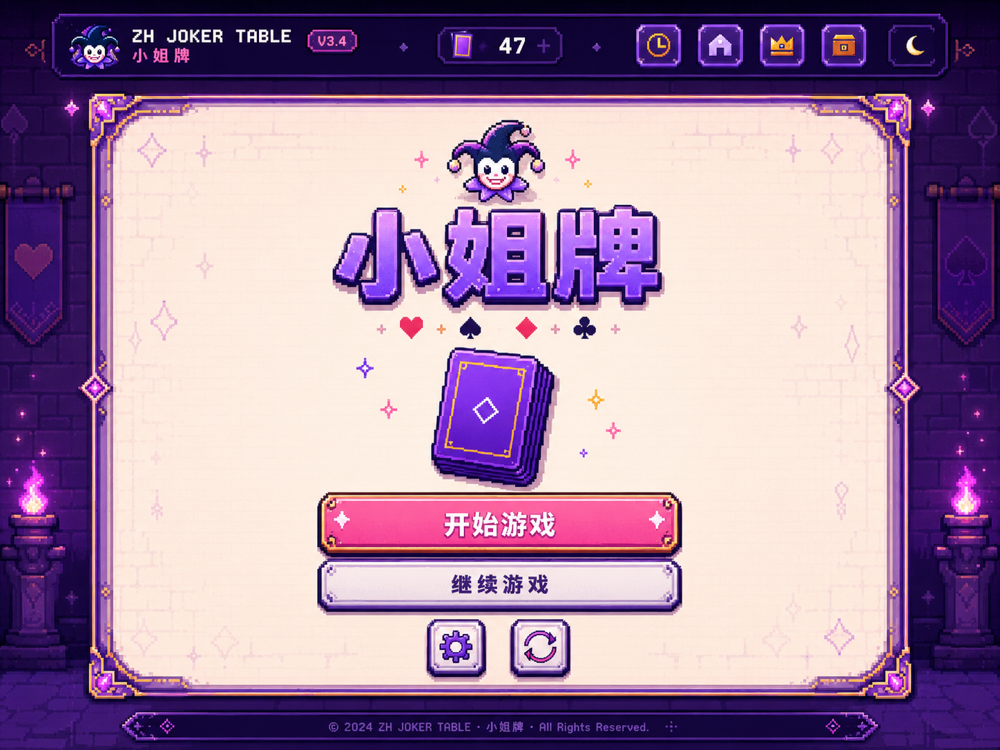
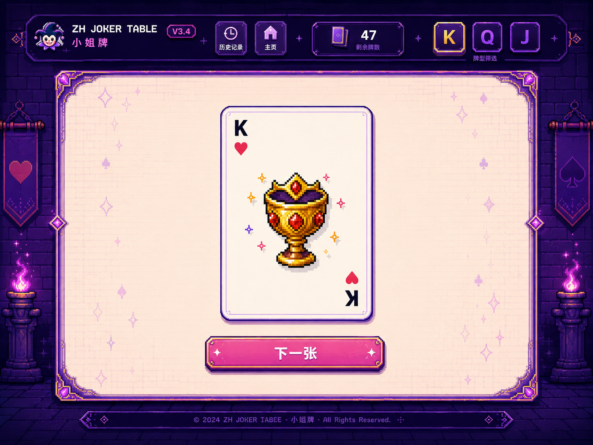
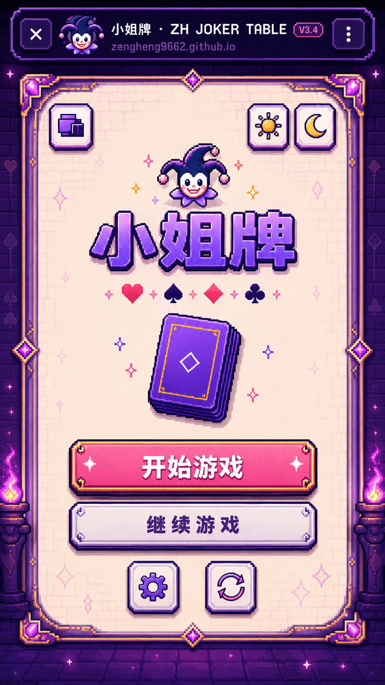
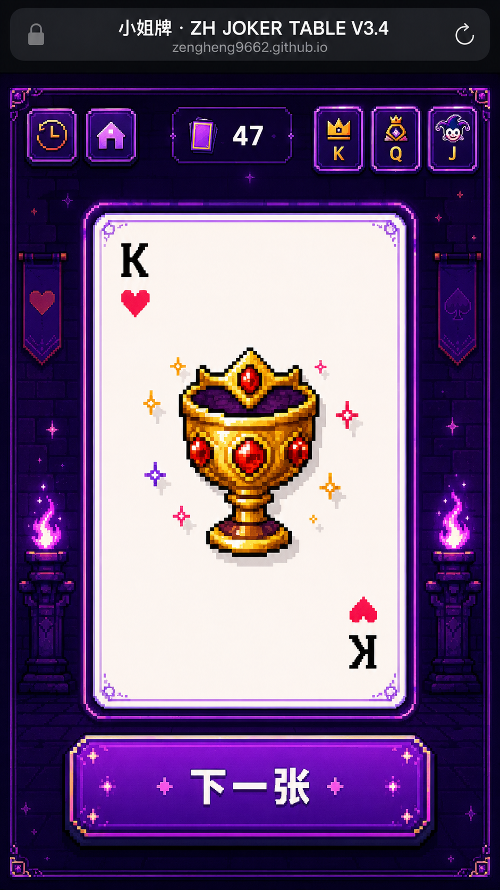

# ZH JOKER TABLE V3.4

一款从真实聚会需求出发制作的轻量级网页小游戏，整合「小姐牌」与「大话骰」两种常用玩法。

## 🔗 在线体验

- Website: https://zengheng9662.github.io/
- Repository: https://github.com/zengheng9662/zh-joker-table

## 🎮 项目介绍

这个项目来自我自己的聚会使用场景。

和朋友出去玩时，经常需要临时购买扑克牌，用完后基本就成了一次性消耗品；而使用手机小程序玩骰子时，也经常会遇到广告、操作过程不透明等问题。

因此，我尝试把「小姐牌」和「大话骰」整合成一个无需下载、打开网页即可使用的轻量化工具。

在视觉上，我结合自己的个人偏好，将页面设计成 **像素游戏风 UI**，并加入翻牌、模式切换、骰盅开合与摇骰等交互动效，让它不仅是一个工具，也更接近一个可以直接上手的小型网页游戏。

项目同时针对手机与电脑端进行响应式适配，希望在真实聚会场景中做到：**打开链接就能玩，规则随时可看，操作足够直观。**

## ✦ 核心功能

### 🃏 小姐牌

- 随机抽取 52 张扑克牌
- 点击牌面翻转查看对应规则
- 自动记录抽牌历史与剩余牌数
- 支持「小姐」「K 规则」「存卡」状态管理
- 支持继续上一局与重置游戏

### 🎲 大话骰

- 一次生成 5 枚骰子
- 点击骰盅开合查看结果
- 支持重新摇骰
- 仅 1、4 点使用红色，其余点数使用黑色
- 与小姐牌共用统一的像素游戏视觉系统

## ✦ V3.4 视觉升级

V3.4 重点不再是增加功能，而是重新统一网页的视觉语言。

- 全部工具图标升级为统一的像素风 SVG 图标
- 桌面端与移动端使用同一套按钮、描边、高光与硬阴影规则
- 首页加入完整的像素游戏标题场景与装饰边框
- 游戏页顶部功能区升级为统一 HUD 状态栏
- 卡牌、按钮、背景纹理与功能图标统一到同一套紫粉像素幻想风格
- 桌面端不再只是放大手机布局，重新优化大屏留白、内容尺度与整体沉浸感
- 增强 hover、按压、发光等交互反馈
- 保留浅色 / 深色主题，但让两种模式保持同一套视觉语言

## 🖼️ V3.4 设计预览

### Desktop





### Mobile





## 📁 文件说明

```text
ZH_JOKER_TABLE_V3.4/
├─ index.html                 # V3.4 页面与交互代码
├─ README.md                  # 项目介绍
├─ VERSION.txt                # 版本记录
├─ 替换说明.txt               # GitHub Desktop 替换说明
├─ assets/
│  └─ icons-v34/              # V3.4 全新像素 SVG 图标
└─ preview/                   # V3.4 视觉设计预览图
```

> V3.4 继续复用原仓库中的 `assets/cards/`、`assets/dice-cup.png` 等游戏素材，因此更新时请保留原有 assets 文件，并将本包中的 `icons-v34` 文件夹复制进去。

## 🚀 Deployment

项目使用 GitHub Pages 部署。

更新完成后，将文件提交至 `main` 分支即可。若 Pages 已设置为 `main / root`，网址不会因为后续更新页面内容而改变。

---

**ZH JOKER TABLE**  
A tiny party game made for real nights out.
